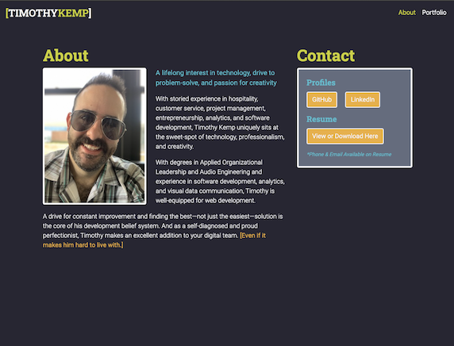
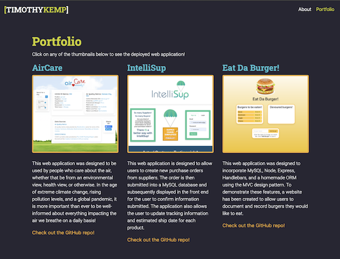

# Timothy Kemp's Portfolio

## Table of Contents

* [Description](#description)
* [Installation](#installation)
* [Usage](#usage)
* [License](#license)
* [Contributing](#contributing)
* [Tests](#tests)
* [Questions](#questions)

-----

## Description

This website is a way for me to showcase my skills as a Full Stack Web Developer. I will continue to update it with new content as I learn and experience new things I want to show off!

### Deployed Version

<https://timothykemp.dev/>

### Screen Shots

-----

## Installation

This is a deployed website, and it does not require installation.

-----

## Usage

This website is a way for users interested in my work to explore my portfolio, view my resume, or contact me directly.

-----

## License

This project does not have a license.

-----

## Contributing

This is a personal website, so no contributions are necessary.

-----

## Tests

No testing is needed for this website.

-----

## Questions

If you have any questions about this project, please free to contact me through my [Github profile](https://github.com/timothykemp) or via [email](mailto:timothymichaelkemp@gmail.com).
  